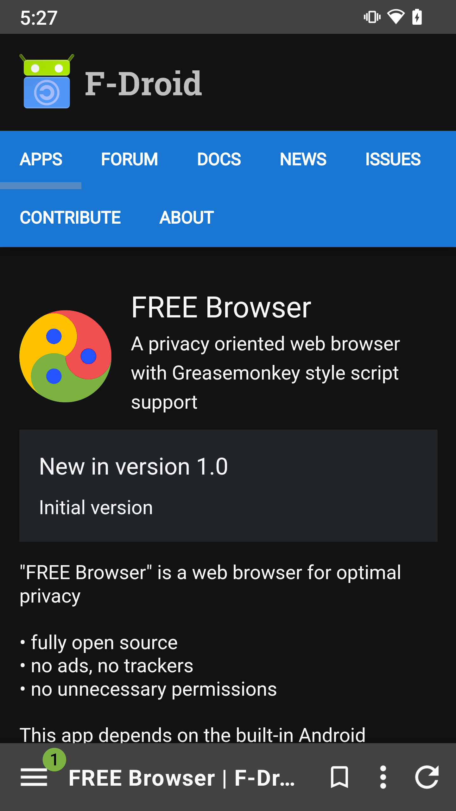
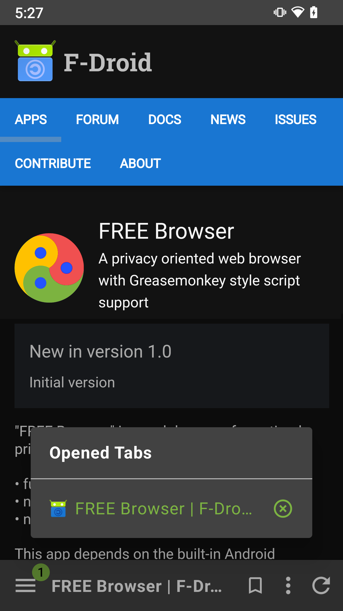
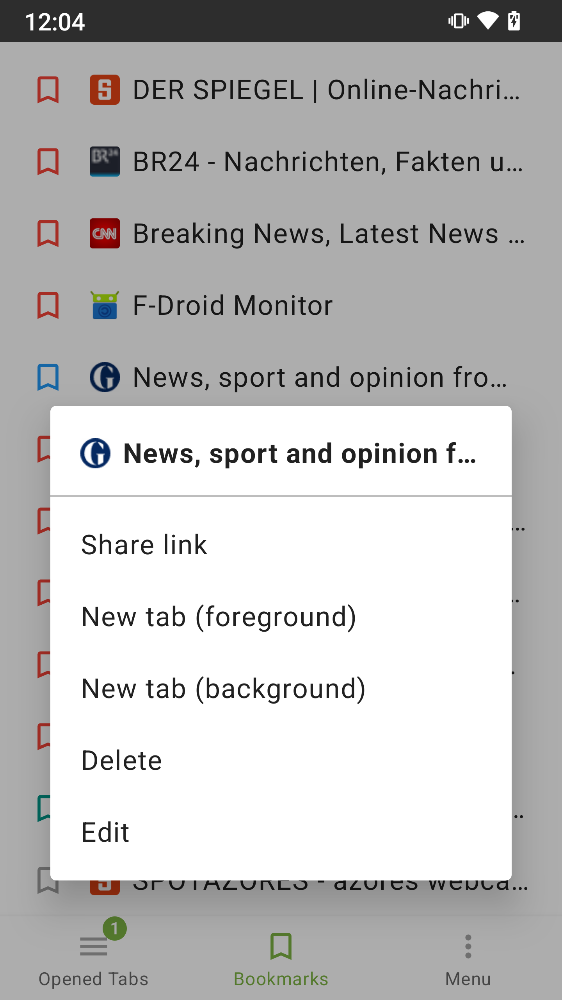
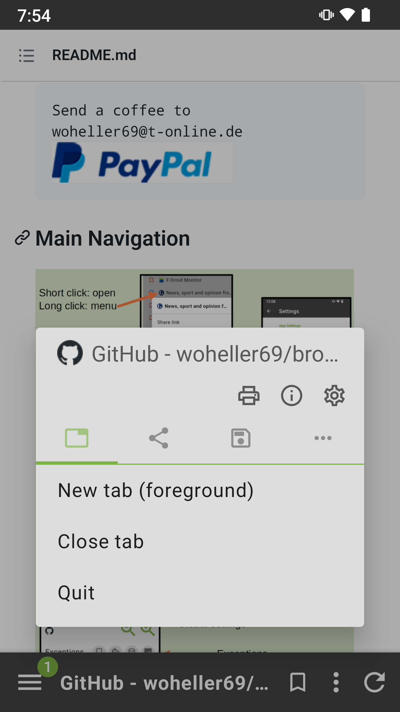
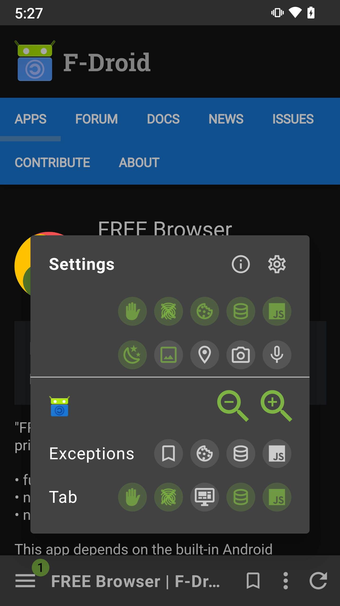
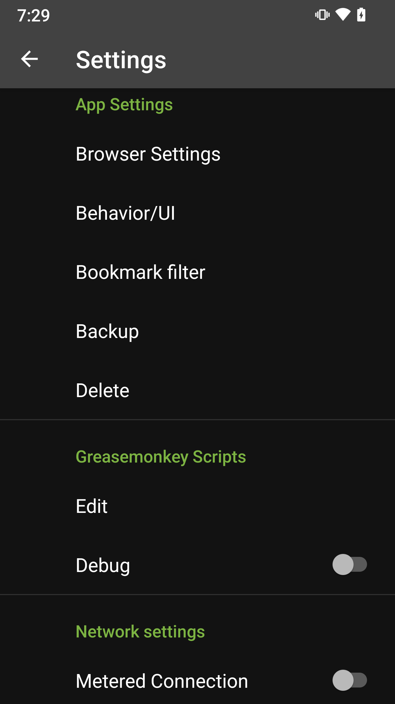
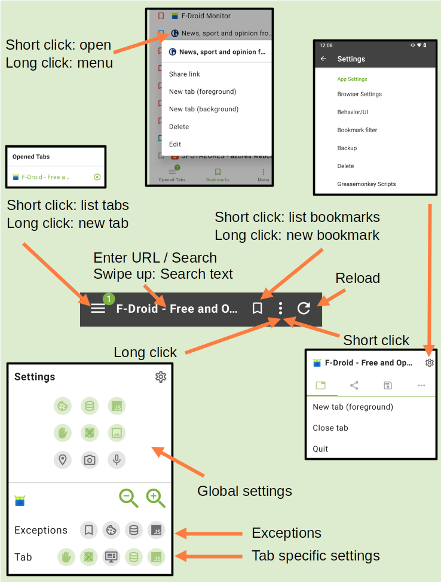

# FREE Browser

    

  

FREE Browser is a web browser for optimal privacy

- fully open source
- no trackers
- no unnecessary permissions

## FEATURES

- AdBlocker using StevenBlack host list
- Measures against browser fingerprinting
- Advanced settings for javascript, cookies and DOM-storage (domain/bookmark based)
- Support for Greasemonkey style scripts
- Optimized for one hand handling (toolbar at bottom)
- TAB control (switch, open, close, unlimited tabs)
- Fast toggle for most important settings
- Search current website
- Web search (from marked text via context menu)
- Save as PDF
- Open links in other apps (for example YouTube)
- Backup
- etc

## LICENSE

This app is licensed under the GPLv3.

The app uses code from:
- FOSS-Browser, https://github.com/woheller69/browser, published under GPLv3 (at time of fork)
- Ninja, https://github.com/mthli/Ninja, published under Apache-2.0 license
- StevenBlack hosts, https://github.com/StevenBlack/hosts, published under MIT license

## INSTRUCTIONS

<pre>Send a coffee to 
woheller69@t-online.de 
</pre>

### Main Navigation

The main navigation features are depicted in the image above.

For each tab it is possible to enable/disable:
- AdBlock
- Anti-Browser-Fingerprinting measures
- Desktop Mode
- DOM-Storage
- JavaScript

These settings (except desktop mode) are inherited from global settings when a new tab is created.
They will always be applied when a new web site is opened.

FREE Browser allows bookmark specific settings for JavaScript, DOM-Storage, and Desktop mode.
If a bookmark is opened these settings will be applied, no matter which other settings are valid for the tab.
If this is the case the bookmark symbol in "Exceptions" will be highlighted. When browsing within the domain of the
bookmark these settings will remain.

In addition you can define domains where Cookies, DOM-Storage, and JavaScript are always allowed (see Settings -> Browser Settings).
Cookies will override the global cookies setting. DOM-Storage and JavaScript will override the tab specific settings.
If one of these exceptions is active the respective icon will also be highlighted in "Exceptions". 
A click on the icon will add/remove an exception.

In additions there are settings which are only available as global settings:
- Allow location access
- Allow camera access
- Allow microphone access
- Download images. This allows to save data, **when not connected to WIFI**. If WIFI is available images will always be loaded.

### Greasemonkey style scripts

FREE Browser supports simple user scripts in Greasemonkey style.
The following tags:
- @match
- @run-at
- @name

@run-at:  
If defined as "document-start" scripts run in onPageStarted() of Android WebView, 
otherwise scripts run in onPageFinished.

Other tags are **NOT** supported at the moment, e.g.
- @include
- @exclude
- @grant
- @required

### Browser Settings

In this section you can define your favourite start page, search engine, etc.
You can select your favourite StevenBlack AdBlock list.
And this is the place to manage exceptions for cookies, javascript, and DOM storage.

### Backup / restore

You can save / restore app data (=databases), bookmarks, and preferences.
Data will be stored in Documents/browser_backup.

# OTHER APPS

| **RadarWeather** | **Gas Prices** | **Smart Eggtimer** | 
|:---:|:---:|:---:|
| |  |  |
| **Bubble** | **hEARtest** | **GPS Cockpit** |
|  |  |  |
| **Audio Analyzer** | **LavSeeker** | **TimeLapseCam** |
|  | |  |
| **Arity** | **omWeather** | **solXpect** |
|  |  |  |
| **gptAssist** | **dumpSeeker** | **huggingAssist** |
|  |  |  |
